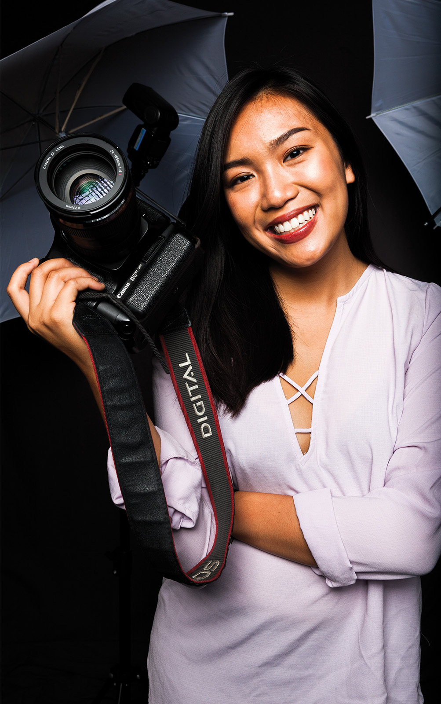

“What is a person or event that changed the trajectory of your life?”

The pen stood still between my index finger and thumb as I pursed my lips,
unable to confront the prompt before me and write an answer on my notecard. I
read the other responses displayed on a blackboard.

“TRUMP,” one screamed in all caps.

“My father’s death during my senior year of high school.”

Five hours later, after the NPR conference ended and I had tucked the card into
my purse, I found the answer: a wedding I attended with my father during my
freshman year of high school.

The bride, the daughter of my father’s childhood friend, married her co-worker.
The pair were both pediatric oncologists at the Children’s Hospital of Orange
County, and they fell in love during their residency.

“I want to be a pediatric oncologist, too,” I told my father at the time.

A toothy grin appeared, partially due to the amount of alcohol he had consumed,
but mostly because of what I had said. It was the first time in my life I had
expressed an interest in pursuing medicine – and this meant the world to my
father. All he wanted was for one of his children to receive an M.D.

This dream was part of a larger goal. My father was a refugee, fleeing poverty
and strife during the Vietnam War era. He was in his final year of medical
school when he left Vietnam at 26, with blind hope for a better life.

My father said freedom and McDonald’s were the first things he tasted in the
U.S. His new life was filled with school and work. My father graduated with a
degree in electrical engineering and set off to sponsor the rest of his family
to come to the U.S.

Now, my family and I live in Orange County, California, enjoying quiet suburbia.
My father is extremely proud of this life – his is the classic tale of an
immigrant success story. He’s fulfilled most of his aspirations. The only thing
left was to raise a doctor.

I really tried to be like the bride at the wedding, to be the doctor that my
father wanted. It’s the reason I worked so hard to attend a top university.
Getting accepted to UCLA, however, was only a small part of the battle. I fought
the rest of it during my first year of college.

I spent the summer before my first year at UCLA poring over lists of pre-health
organizations and volunteer opportunities, making spreadsheets that listed when
I would become involved in each one.

Among my friends, I was the resident pre-med expert, chiming in to answer
anyone’s questions about the daunting requisites for admission to medical
school. I became a UCLA Health volunteer during spring quarter of my first year.
I was so proud when I first received my volunteer badge and uniform, but mostly
because I had made my parents proud.

I wasn’t always the model doctor-to-be daughter. I hated my hospital volunteer
job in high school. I joined the newspaper and yearbook instead of the medical
society. I despised biology, but was miraculously adept in chemistry – a skill I
often used to compensate for my revulsion for cells and anatomy. Although the
summer before my first year at UCLA was full of pre-med extracurricular
planning, I did not end up following my self-prescribed program.

I joined the Daily Bruin instead of a pre-med fraternity. I traded my volunteer
coat for business attire in Model United Nations at UCLA. Chemistry bored me to
tears, and I couldn’t fathom doing a double integral in calculus. I hated every
second I spent in my life sciences lectures and couldn’t bring myself to enjoy
one bit of the material. A blank form for shadowing a pediatric oncologist sat
on my desk, collecting dust, while I eagerly filled out applications for new
positions in the Daily Bruin and MUN.

It took me a whole year to realize that much of my hatred for my collegiate
studies stemmed from my own underlying disinterest in science and medicine. But
why did it take me so long to realize I loathed the field and everything that
came with it?

Because I did it for my father, who dropped everything he had 40 years ago in
hope of a better life for himself and his children. I majored in biochemistry
instead of political science for him. I faked my fascination with the chemical
nature of DNA every week during office hours for him. I sat in tears at the end
of each quarter, hoping for a better one to follow, for him.

I want to be a journalist, a politician or even a teacher. Being a photographer
sounds nice, too.

I excel in the humanities and struggle with science and math. I never dared to
utter these words in front of my father, in fear of shame and disappointment.

And I’m not the only one.

When she was 15 years old, Zainub Ali, a fourth-year human biology and society
student, visited family in Pakistan. During lunch one day, her cousin Bushra
voiced her ambitions of pursuing medicine. Ali's uncle suggested Ali should
pursue the field instead of her cousin.

“He jokingly said, 'Oh, you know she’s not gonna become one,'” Ali said,
recalling her uncle’s remarks.

It was then she realized the privilege she had living in the U.S. While many of
her female relatives her age were getting married, she was continuing school.
Ali felt she owed it to her family in Pakistan to become a doctor.

But joining pre-med organizations put a burden on Ali, and after a slew of
rejections, she realized that medicine was not the ideal path for her.

“Being pre-med just takes so much time out of you that if you’re not serious
about it, then you’re not going to be happy in it," she said. "I just felt like
I was doing the motions (of pre-med classes and organizations) and I wasn’t
experiencing them or feeling happy about it."

Now, Ali is pursuing a career in genetic counseling and feels less weight on her
shoulders.

Jasmine Chen entered UCLA as a chemistry student. Chen’s parents wanted her to
become a pharmacist, but pharmacy failed to spark her interest.

Chen, now in her second year, said her lack of affinity for molecules and atoms
led her to stop taking chemistry courses winter quarter of my first year and
switch to business economics.

This decision was scary for Chen. It was the first time she had ever defied her
parents.

“For me, it doesn’t really matter what your parents want from you, but if it’s
not making you happy and if you don’t want to do it, then just don’t,” Chen
said.

Many Asian-American students like Ali, Chen and I are raised with the idea that
pursuing a career in medicine, science or engineering is the only path to
success. And there is a reason why so many Asian-American parents frame success
so narrowly – they grew up in societies in which education was the only means of
social mobility.

My grandmother grew up in war-torn Vietnam and never had a formal education. She
raised her six children, including my mother, in a tailor shop run from her
home, working day and night, dealing with aggressive customers. My mother’s
escape from the frenzy was school. If my mother got through school, she would
find a high-paying job and not have to live paycheck to paycheck. Education was
her path toward a better life.

My parents immigrated to the U.S. to find that better life. However, their road
wasn’t without obstacles. Many Asian-American parents fear discrimination
because of cultural differences.

“There is almost no Vietnamese in Washington, D.C.,” my father often told me.
“Only white.”

It’s why he encouraged his children to pursue careers in medicine and
engineering, where advanced degrees and GPAs might protect them from
discrimination.

Parents don’t want their children to be worse off than they were. If I became a
doctor, I most likely wouldn’t have to live with financial burdens – at least,
this is what my parents and many others like to think.

Third-year theater student Vivi Le has also had to deal with her parents
dictating her professional aspirations. Le’s mother sat in her own feces on a
boat that served as her escape from Vietnam, and now her parents work odd jobs
to make ends meet. Their hardships deterred Le from a career in the arts.

But Le grew up watching Jackie Chan movies. At a young age, she told her mother
that she wanted to be an actress.

“She straight up told me that Asian people don’t act and Asian people don’t go
on film," Le said. "The effect of this conversation stuck with me for a very
long time."

This talk with her mother didn’t stop her from loving theater, although she set
her acting dreams aside in high school. Le wasn’t involved in drama clubs and
didn’t take any acting classes; instead she played basketball and volleyball and
served on the student council.

Yet Le applied to 18 colleges as a theater major.

“I was so guilt-ridden,” Le said. “I thought, 'If I pursue this, I am the most
selfish person in the world. If I do this, I am only thinking of myself, not of
my parents and my family who I have to take care of when I graduate.'”

Le knew she was taking a huge risk. UCLA had been her dream school since she was
2 years old. The theater program at UCLA has a low acceptance rate, and denial
from the program meant rejection from the institution as a whole.

“I realized that if I didn’t do this, I would be unhappy my entire life. At the
end of the day, I realized that I would suffer myself before I would let my
parents suffer,” Le said.

To this day, Le’s parents are not happy with her decision. Whenever her mother
calls her, she still asks if Le has changed her major yet. She doesn’t tell
people that Le is a theater student, only that she is a student at UCLA.

“I feel like I am not the type of daughter my parents deserve because I’m not a
doctor or engineer,” Le said.

Le realizes her mother acts this way out of fear of financial instability and
because she perceives Le's decision as naive and impulsive. Despite this, she
believes her parents are truly proud of the person she has become.

“It’s the type of Asian love they don’t (articulate),” she said.

When Le spends the night at home, her parents still pull up the blankets over
her head, brush her hair off her face and kiss her goodbye before they leave for
work at 4 a.m.

“At the end of the day, they don’t want me to be hurt and they don’t want me to
suffer, but they want me to live a life where I’m happy,” Le said.

I don’t blame my parents for wanting me to be financially stable. I know my
father didn’t ride a dilapidated boat into the middle of the ocean in 1975 for
me to become a journalist. But when I think about the future, I don’t see myself
in a white coat.

I have called myself a perfectionist in many self-deprecating jokes told
throughout the years, citing my fear of failure. I don’t think I have a fear of
failure anymore, but rather of disappointing the two most important people in my
life: my parents. Their sacrifice is a gift I can never repay. I love them.

But I also love myself.

I haven’t told him yet. My father will be disappointed in me – I already know.
He still thinks I’m pre-med, volunteering and taking biology classes. I’m not
lying to him; The human biology and society major requires me to take a life
sciences course this quarter. Hour-long lectures, fights, awkward car rides and
his dark and clouded eyes will await when I decide to tell him my decision. It
will hurt him a lot, but it will hurt me especially.

I no longer dream of becoming a pediatric oncologist. Actually, I don’t dream of
anything. My future is a dark ocean, like the one my father sailed across for
three days. It’s dark, turbulent and scary. My father’s light was America. Mine?
I’m still in that rocky, pitch-black phase, but by doing what I love, I’ll
eventually find my way.
