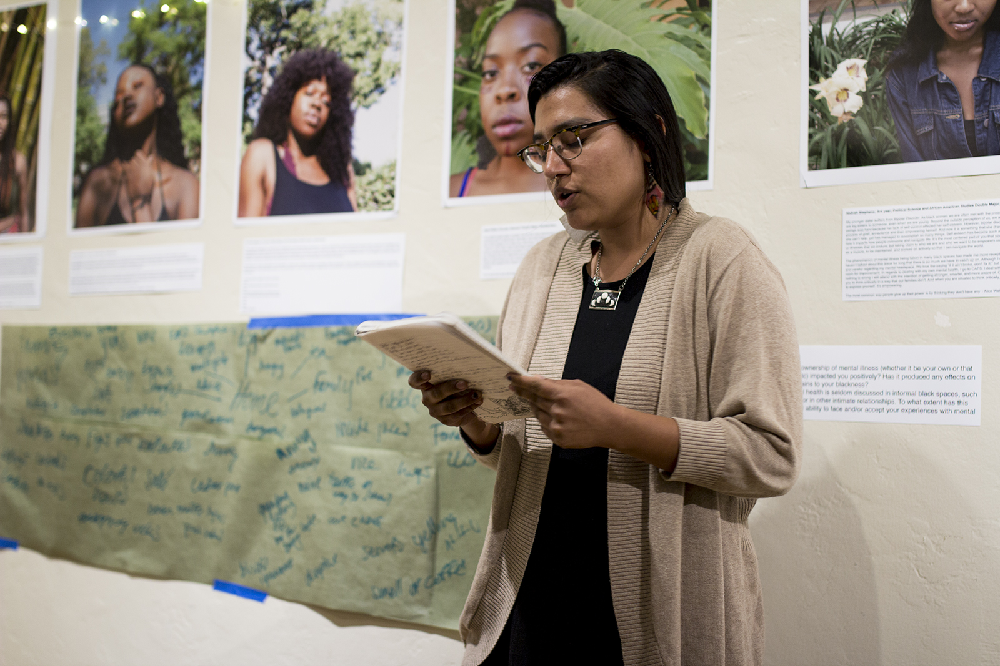

Every week, Kerckhoff Art Gallery transforms from an often-overlooked study spot
to an open mic space for The Word on Wednesday.

Fairy lights are set up in the front of the room and a wrinkled piece of paper
stipulates that attendees should not get up during a performance, and most
importantly, not express anything that falls under an “ism,” such as sexism or
racism. The Word on Wednesday establishes itself as a refuge for poets to
discuss anything without fear of judgment. To the students who fill the gallery
each week, the event is an open safe space for poetry, political rants,
confessions of unrequited love and everything in between.

Hosted by the Cultural Affairs Commission of the Undergraduate Students
Association Council, The Word on Wednesday also helps students build cultural
awareness through listening to the experiences of their peers. Many regular
attendees agree The Word provides students stuck in the UCLA bubble with a
much-needed culture shock.

Any student is welcome to listen and perform during the night. Some come
prepared with little blurbs typed up in the notes section of their phones, and
readily sign their names to the clipboard of performers when they step in.
Others linger in their seats until they finally pluck up the courage to stand
and recite the words buzzing in their heads.

Some weeks, The Word will host special events like poetry workshops, where
anyone in the UCLA community can take a moment to reflect and write on a
designated prompt. However, the general routine of the Wednesday night open mic
has become quite consistent since The Word’s inception in 2010.

Students and sometimes faculty file into the gallery around 7 p.m. Hosts pose
the night’s “fishbowl question” for students to answer on a slip of torn
notebook paper and anonymously place into a box. The Word's staff members pass
around a clipboard for poetry sign-ups. Then, the poets commence and the
responses to the fishbowl question are pulled out between every two recitations
to lighten the often somber mood.

Fishbowl questions range from favorite “fuckboy fire” songs – catchy songs with
problematic lyrics – to advice for your younger self. Poems cover topics such as
the art of making a good Spotify playlist and the damaging effects of sexual
assault.

Though the schedule of the meetings has become second nature to longtime
members, the dynamic of each open mic night is defined anew every Wednesday.
Some nights, the mood is heavy with the sharp aftertaste of stories of abusive
lovers, racist encounters and gang violence. Other nights, singers covering SZA
tracks and harpists playing solos contribute a spiritual lightness to the space.

Most nights, the two sides of the spectrum go together harmoniously; the amusing
fishbowl questions weave effortlessly in between the existential or somber
nature of the poems.

## Bianca Brown

**_My whole life is my love life._**

**_at least that's what it seems._**

**_I find it difficult to write about the deeper stuff, the shit that REALLY
bothers me_**

**_Like how I am a black dot on a white piece of paper & this institution is
only using me as one of their few tokens_**

**_Or how I let in every pretty girl with nice eyes and a smile that's
broken._**

**_Or how my depression, yes depression, I have depression, & I've never been
able to tell my parents._**

**_My dad is black, my mom is Asian, 2 communities that treat mental illness
like they would an open wound,_**

**_Slap a bandaid over it, ignore it, keep it movin._**

**_But I have it, oh god I have it, I've had it since middle school_**

**_But I've buried it, tossed it to the side, piled it up with something,
anything that might close this gaping fucking hole in my chest._**

**_Maybe that's why I'm so focused on love, on every girl that parades sweet
nothings off of her poisonous tongue_**

**_Because it fills me whole temporarily, until the venom from the root of her
fingers eventually comes undone_**

**_and it cools then suffocates every vein in my body, & every rotten thought in
my head &_ _suddenly I'm no longer depressed._**

**_No. I hit rock fucking bottom._**

**_The gaping hole now bigger, has hardened as well_**

**_& the bodies natural reaction is to of course fix the problem. heal this
invisible disease that's corroding me from the inside out._**

**_I don't feel like myself anymore._**

**_I can't feel myself anymore._**

**_I try to drink it away, get high to alleviate the pain_**

**_I told my parents I'm hurting, they say the problem is that I'm gay_**

**_Going against "Gods natural order," of course he's going to make you
suffer_**

**_He's going to seal the air around you, suffocate you, destroy you, but still
claim "I love her"_**

**_Because he does, Bianca. God is everything you'll ever need._**

**_Whenever you're feeling sad, just get down on your knees_**

**_But they don't understand that that has never worked for me._**

**_I'm a human._**

**_I need help._**

Bianca Brown was scribbling some notes on the side of her paper during a gender
studies class when her project partner, a staff member of The Word at the time,
noticed the words she was writing were lines of poetry.

That classmate eventually introduced Brown, now a third-year philosophy student
and co-host of The Word on Wednesday, to the weekly open mic nights.

Although Brown often wrote poetry as a means of getting through some of her
hardships during high school, she never imagined herself performing her pieces
in front of an audience.

“I wrote a lot of poetry in high school, but I never read anything. ... I was
hella closeted, so I wrote about being trapped and wrote about little crushes,”
Brown said. “I was lowkey very emo in high school, so I used poetry to write
about (my experiences).”

When Brown began attending The Word during her first year at UCLA, she was
struck by the authenticity of the artists and their willingness to share
personal stories as an art form. Brown said the artists helped her see the good
that could come from sharing her own private struggles.

“I stopped setting myself to a standard after hearing the poets at The Word,”
she said. “I used to compare myself to other artists, but now I feel whatever I
want to and am less afraid to share parts of me that I had trapped inside
before.”

The Word often features poems about deeply personal topics, such as closeted
homosexuality and experiences with abusive partners, and Brown said she was
especially comfortable talking about her own experiences knowing that others
would empathize. Brown trusted that her poems would reach receptive audiences
who could connect to her messages even though they were complete strangers.

“The first time I went to (The Word) I said, ‘I am not going to read,’” Brown
said. “But when you get there and listen to people perform and others who give
support to the performers, you get an urge to share a part of yourself you never
would have wanted to before.”

## Jabril Muhammad\**

**_Song: Who Shot Ya?_**

**_Artist: Piggy Smalls_**

**_Mixtape: Black and Blue_**

**_Who shot ya?_**

**_A question for the young G's murdered by the OG_**

**_Thug kings with M16s, rings, and every weapon between_**

**_Who handle all the things we call criminal at subliminal home precincts_**

**_I said who shot ya?_**

**_A question for the whole world, a question for the young girls and queens, a
question for me_**

**_The bronze token, a charlatan, a penny who ain't wise enough to recognize
when white supremacy clowns me_**

**_Although I know the CIA played drugs all through ya neighborhoods_**

**_Then a war on drugs brought hugs 'tween wives and prison mates_**

**_Regardless I drive, Black, white, blue all through ya neighborhoods_**

**_You call me Uncle Tom but my brother Sam payin' me to stay_**

**_It's no debate to me, cuz_**

**_despite the moral wickedness you claimin',_**

**_all I'm sayin' is I'd rather be a Tom than Tray_**

**_Haters gonna hate, but this food on my table,_**

**_And my girls' sweet dreamin's worth the price I gotta pay_**

The roots of Jabril Muhammad’s poetry go back to his sixth-grade spelling
assignments.

While other kids raced to finish writing sample sentences for their designated
spelling words, Muhammad had no problem taking his time. In fact, he made it a
point to make his sentences eloquent – poetic, even.

The fourth-year sociology student's father exposed him to poetic expression
early on by listening to hip-hop and rap.

“Growing up, I knew that rap was an acronym for rhythm and poetry,” Muhammad
said. “I knew from a young age that rap is a form of poetic expression.”

This early exposure to spoken word made Muhammad eager to experience The Word
when his friend asked him to attend in the spring quarter of his first year.
During his first open mic night, Muhammad felt so comfortable in the space that
he ended up performing.

“The space is a free space and in that way, it represents a subversion of the
injustices we feel on a daily basis,” Muhammad said. “Usually, the world
suppresses some voices, but this experience of freedom really encapsulates the
notion of social justice.”

From the beginning, Muhammad felt The Word was a place where it was safe to
speak about his experiences, especially dealing with institutional racism.
During his third year, Muhammad was the resident assistant of the Afrikan
Diaspora Living Learning Community, where he was able to hear about others’
experiences being racially profiled and immerse himself in Black culture. These
experiences also inspired his poetry, he said.

Muhammad often talks about the Black experience in his poetry, including the
accompanying poem, in which he imagines a Black policeman who must confront the
issue of police brutality. By speaking about the struggles Black people face and
his own experiences as a Black man, Muhammad brings awareness to the
marginalization of Black communities, which are often left out of discussions
both on campus and in society as a whole.

“The most powerful tool of humanity is the ability to name things,” Muhammad
said. “When we talk about silent oppression, it is not until we put a name to
(our struggles) and talk about them that we take away the power from (the
oppressor).”

## Karla Duarte

**_“Phantom”_**

**_My house is not a home anymore_**

**_It is not peach walls and sacred plants_**

**_It is not wrinkled hands holding me in place_**

**_Preventing me from slipping into my own made abyss_**

**_It is a paradise now._**

**_I long to flee to it. I nozzle my face in the arms that bore me but I am no
longer able to embrace them_**

**_I, a phantom now have taken the place of the person I once was_**

**_Or maybe I never was. I always was what I am now_**

**_A Paradox of walking death with the sun kissing her cheek_**

**_Maybe I always was an empty shell, a barren cocoon_**

**_A stillborn believing I made it through my mother’s canal, Holy._**

**_My eyes sinking into my skull as I watch the shadows I used to call friends
exist without me._**

**_I am only there for the sake to hear my name in voices that aren’t hollow_**

**_Can you say it again?_**

**_My name._**

**_My name?_**

**_My…_**

Karla Duarte identifies with many different labels: El Salvadorian, feminist,
transfer student, queer and, recently, genderqueer – using pronouns "she," "her"
and "theirs." The fourth-year anthropology student uses The Word as a place to
learn about herself by sifting through her intersecting identities.

The Word serves as an open space for Duarte to talk through hardships she faces.
She often brings up her many classes that depict Central Americans in an
unfavorable light.

“Going into my major, I thought this would be where the professors of color
would be and I could finally learn about my experiences in an academic setting
and grow,” she said. “But it always happens to be white professors, and it often
feels like an outsider looking in and pointing out the flaws of my people.”

Duarte said she often sees her people represented poorly when professors speak
about deeply ingrained institutional issues. For example, they discuss the
struggles of poor nutrition or lack of mental health resources in a negative
light, without understanding the socio-economic factors behind these issues.
Duarte recalled an especially frustrating incident in which her professor
criticized the diets of Central Americans for being unhealthy and conducive to
obesity and diabetes, without addressing how poverty in the region leads to such
conditions.

As a way of speaking up against some of the misguided ethnocentrism she has
faced in class, Duarte has taken to poetry to express her anger and educate
people about her background.

“Sometimes I hear something a professor says that erases a lot of my history and
out of that erasure, I start prewriting,” she said. “Then I find the lines that
I like and I go from there.”

Although she does not shy away from engaging with her professors’ comments in
thought-out response papers, Duarte is most comfortable letting out her
frustrations during The Word. She said she does not feel the need to curb her
discontentment among people willing to understand her viewpoint and remind her
that her anger is justified.

“I appreciate when a lot of my professors give response papers, and I vent my
anger in an academic sense,” Duarte said. “But at (The Word), I do not hold back
and I pick apart every intersectionality the professors miss.”
